  

---

<table width="100%" cellspacing="0" cellpadding="0">
  <tr>
    <td valign="top" width="68%">
      <h3>Tech Stack</h3>
      

      

      

      

      

      

        
        
        
        
      

      

        <em>Strong languages (daily use):</em> <b>PHP</b>, <b>TypeScript</b>, <b>JavaScript</b>, <b>Go (Golang)</b>. 
        <em>Also experienced with:</em> Dart/Flutter, Python, C/C++, Node.js/Express, Laravel, React/Next.js, Vue/Nuxt, Tailwind, PostgreSQL, MySQL, Redis, Firebase, AWS.
      

      
<em>Focus:</em> reliable backends, clean data models, maintainable APIs, and mobile apps that respect users’ time.

    </td>
    <td valign="top" width="32%">
      

        
        
      

    </td>
  </tr>
</table>

### About Me
I’m a full-stack and systems-minded developer who cares about production more than slides. I build pragmatic backends, clear data contracts, and mobile UIs that make everyday workflows simpler—especially in settings where correctness and traceability matter (hospital intake, household services, personal ops). I prefer boring, reliable infrastructure, explicit boundaries between repo/service/handler layers, and a feedback loop that includes logs, metrics, and a path to rollback.

### What I'm Building
- **HomeService** — Go + pgx + Clean Architecture → modules: auth, users, notes, purchases, uploads, chores, weather, contractors  
  Mobile: Flutter + Riverpod + GoRouter
- **PPK Pre-Service (Hospital)** — Next.js + Laravel + MySQL → referral-engine, clinic-engine, printable forms
- **Per-Service Management** — barrier token auth, Thai ID integrations, gov-style UI

These projects share the same philosophy: small composable modules, explicit JSON shapes, predictable deployments, and documentation that explains how the system behaves under real-world pressure.

  <b>Crafting production-grade backend systems with precision architecture and automation excellence.</b>

  
  
  
  
  

---

### Platform Modules
`Identity & Access Control` • `Audit Logging` • `File Service` • `Workflow Engine` • `Event Pipeline` • `Notification Center` • `Clinic Routing Engine` • `Purchase State Machine` • `Contractor Discovery`

### Selected Modules (Specs)
- **Notes** — search, pin, SQL filters, repository pattern  
- **Purchases** — state machine <code>planned → ordered → bought → delivered</code> with clear transitions and auditability  
- **Uploads** — file service + trigger <code>files_before_write</code> (validate name, size, type)  
- **Referral Engine** — UTI / Cellulitis / Animal Bite rules + clinic routing (encode decisions, avoid tribal knowledge)  
- **Contractors** — geolocation + type filter + deep link to maps/call for fast access

### DevOps
- Docker multi-stage builds and images structured for cache efficiency  
- CI/CD via GitHub Actions; consistent pipelines from local → staging → production  
- PostgreSQL with migration guards; RBAC, JWT auth, and structured logging  
- Zero-downtime deploys where possible, with rollbacks and observability baked in

---

### Showcases
- **HomeService – Go backend + Flutter mobile**  
  Modular domain, pgx repositories, services with clear invariants, and Flutter app using Riverpod/GoRouter.
- **PPK Form System – Next.js + Laravel**  
  Printable forms, audit trails, and well-defined referral/clinic engines suitable for clinical workflows.
- **Surgical-OPD Registry – Nuxt + MySQL**  
  Clean data capture, exports, and pragmatic pages for real teams.
- **Monitoring Dashboard – Go + PostgreSQL**  
  Workers, scheduled jobs, and alerts that keep operators informed without noise.

---

### Metrics

  

### Education & Career Timeline
<table align="center">
  <tr>
    <th width="20%">Year</th>
    <th width="20%">Institution</th>
    <th width="25%">Role / Status</th>
    <th width="40%">Description</th>
  </tr>
  <tr>
    <td align="center">2021 - Present</td>
    <td align="center"></td>
    <td>B.Sc. in Information Technology (Undergraduate)</td>
    <td>Rambhai Barni Rajabhat University (RBRU), Faculty of Science and Technology</td>
  </tr>
  <tr>
    <td align="center">2025 - Apprentice</td>
    <td align="center"></td>
    <td>Full-stack Developer</td>
    <td>Phrapokklao Hospital (PPK), Chanthaburi</td>
  </tr>
  <tr>
    <td align="center">Plan to</td>
    <td align="center"></td>
    <td>Master's Degree Goal</td>
    <td>King Mongkut’s Institute of Technology Ladkrabang (KMITL), School of Engineering</td>
  </tr>
</table>

---

### Contact

Portfolio: <a href="https://imookatayou.github.io">imookatayou.github.io</a> ·  
Email: <a href="mailto:jetsribumrung@gmail.com">jetsribumrung@gmail.com</a>

