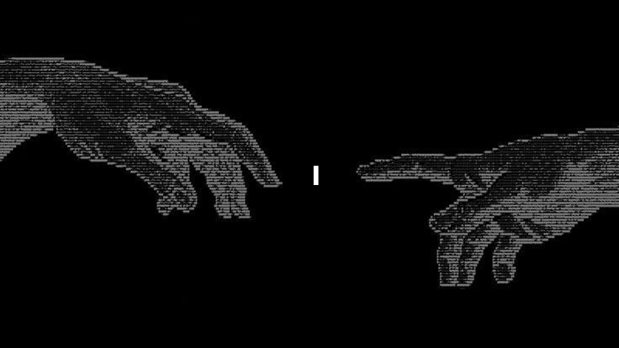
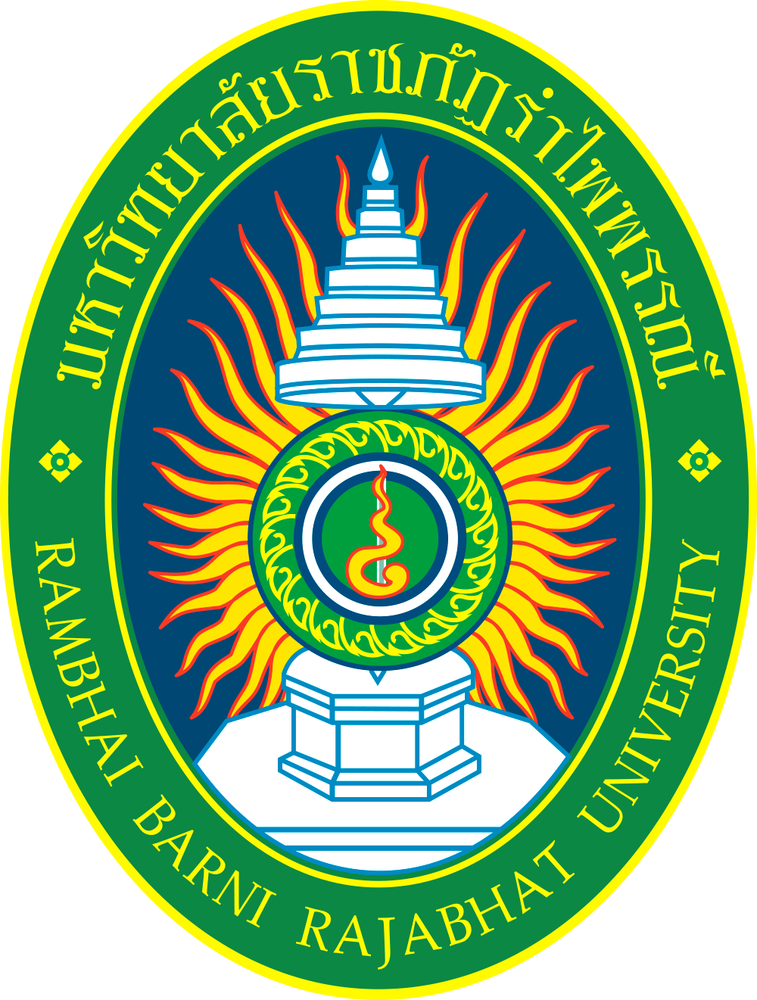
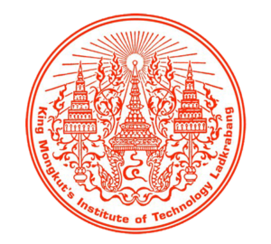
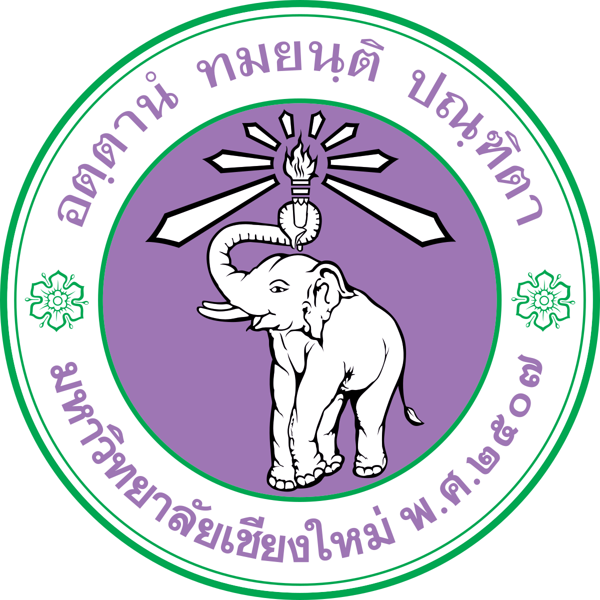
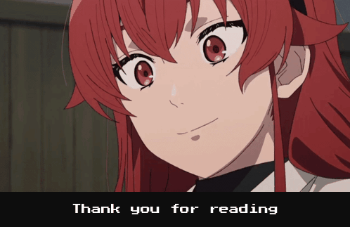

  

    
  

  

  <table width="100%" cellspacing="0" cellpadding="0">
    <tr>
      <td valign="top" width="68%">
        <h3>Tech Stack</h3>
        

          
        

        

          
        

        

          
        

        

          <em>Main stack (daily use):</em>
          <b>TypeScript</b>, <b>Go (Golang)</b>, <b>PHP</b>,
          <b>React</b>, <b>Next.js</b>, <b>Laravel</b>, <b>Vite</b>, <b>MySQL</b>, <b>MongoDB</b>.
        

        

          <em>Focus:</em>
          scalable backend systems, secure APIs, clean database design,
          and high-performance web applications.
        

      </td>
      <td valign="top" width="32%" align="right">
          
        
      </td>
    </tr>
  </table>

  <b>Crafting production-grade backend systems with precision architecture and automation excellence.</b>

  
  
  
  
  

---

### Education & Career Timeline

<table align="center">
  <tr>
    <th width="20%">Year</th>
    <th width="20%">Institution</th>
    <th width="25%">Role / Status</th>
    <th width="40%">Description</th>
  </tr>
  <tr>
    <td align="center">2021 - Present</td>
    <td align="center"></td>
    <td>B.Sc. in Information Technology (Undergraduate)</td>
    <td>Rambhai Barni Rajabhat University (RBRU), Faculty of Science and Technology</td>
  </tr>
  <tr>
    <td align="center">2025 - Apprentice</td>
    <td align="center"></td>
    <td>Full-stack Developer</td>
    <td>Phrapokklao Hospital (PPK), Chanthaburi</td>
  </tr>
  <tr>
    <td align="center">Plan to</td>
    <td align="center"></td>
    <td>Master of Engineering (Computer Engineering)</td>
    <td>King Mongkut’s Institute of Technology Ladkrabang (KMITL), School of Engineering</td>
  </tr>
    <tr>
      <td align="center">Plan to</td>
      <td align="center">
        
      </td>
      <td>Master of Engineering (Computer Engineering)</td>
      <td>Chiang Mai University (CMU), Faculty of Engineering</td>
    </tr>
    <tr>
      <td align="center">Plan to</td>
      <td align="center">
        
      </td>
      <td>Master of Engineering (Computer Engineering)</td>
      <td>University of Technology Sydney (UTS), Faculty of Engineering and Information Technology</td>
    </tr>
</table>

  

  

   

  

  

  <h3>Techin</h3>
  
Full-stack Developer Bangkok, Thailand

   

  
  
  

    

  Thanks for stopping by © 2026 Techin

